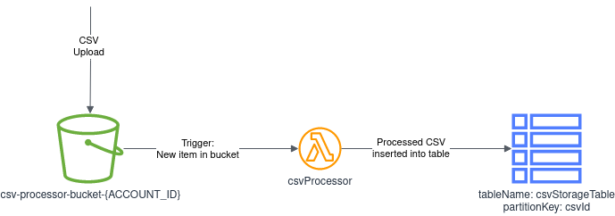

# aws-csv-processor

## Introduction

This project creates infrastructure that processes a CSV when it is uploaded to an S3 bucket, and puts the data contained in the CSV into a DynamoDB table.

The Lambda function expects a column named 'customer_id' in the CSV - if this column does not exist then the function will fail to put the data into the DynamoDB table.

The rest of the columns in the CSV will be inserted into the DynamoDB table dynamically.

## Choices/Context

Rough sketch of infrastructure can be seen below



### Infrastructure-as-code - Python CDK
* Python CDK was chosen to be used to provision AWS infrastructure
* I've also chosen to allow the CDK to take care of uploading the Lambda function code - in a normal scenario I might handle this differently, it depends on the use-case.

### S3 Bucket
As specified, an S3 bucket was created to facilitate the upload of CSVs

Bucket is:
* S3 encrypted
* Versioned
* Enforces SSL
* Set to purge/delete on stack deletion (whether I would enable this for a real bucket depends on use-case - for this it's fine)

### Lambda Function
Lambda function is defined using aws_lambda_python - I wouldn't use this for production use-cases as it's still in preview, but this gave me a chance to experiment with it (and it works really nicely/easily)

Log retention is set to 7 days to reduce accumulating logs in Cloudwatch.

The Lambda itself is written in Python - it:
1. is triggered by S3 upload
2. downloads the CSV to tmp
3. extracts the data from it, if `customer_id` is present in the columns
4. transforms it to the desired structure for DynamoDB
5. Puts the items into DynamoDB

I chose to `update_items` in DynamoDB rather than bulk loading them, since the bulk operations can't handle updates. If I had more time to refine this I'd probably build something to separate the updates from the creates, to reduce the amount of API calls required in total and speed up performance.

Some vasic unit tests are in place to test the functionality, but coverage is nowhere near 100% due to lack of time.

A basic alert is in place which will fire when the Lambda function errors out. No action is defined as I didn't have time to set something up yet.

More error handling could probably be added, but didn't have time to refine it further yet.

### S3 trigger
Uploading a new file to the S3 bucket triggers the Lambda - this is the only trigger I've set, I decided not to do anything on CSV deletion etc. A filter was added to ensure only .csv files are processed by the Lambda

### DynamoDB
DynamoDB is used to store the data from the CSV. This seemed to be the best sort of storage to use for this as it's structured, low maintenance and high performance. It can also handle basically whatever data we throw at it.

Table is:
* Encrypted
* Set to pay per request billing mode as for this use case there's no need for provisioned capacity
* Set to remove all data on destroy - this I would almost definitely not do for a real application.
* 'customer_id' is the partition key and required for all items being entered in the table.

### CI/CD & pre-commit hooks
CI/CD has not been setup due to lack of time.

However, pre-commit hooks do some basic checks on all commits. Documentation for this can be found here: https://pre-commit.com/
Pre-commit configuration can be found in `.pre-commit-config.yaml` - here you can see which pre-commit hooks are enabled

## Pre-requisites
## Setting up AWS account
* Create user with sufficient privileges for deployment
* CDK bootstrap `cdk bootstrap`

## Local development
### Prerequisites
* AWS CDK installed
* Python 3.6+ installed
* Python venv installed
* Docker installed (we're using a construct for Lambda which requires this locally)
* AWS credentials configured

### Python venv setup
* Be in root folder of this repo
* `python3 -m venv .venv`
* `source .venv/bin/activate`
* `pip install -r requirements.txt`
* You're now running in your local dev environment

### Pre-commit hooks
Pre-commmit hooks are used to ensure quality of committed code. Documentation for this can be found here: https://pre-commit.com/
Pre-commit configuration can be found in `.pre-commit-config.yaml`

This can also be run manually to check all files from within the venv: `pre-commit run --all-files`

### Run unit tests
```
./run-unit-tests.sh
```

### Deploying from local
* NOTE - `cdk bootstrap` needs to have been run first for this to work
* Run `cdk synth` to check that cdk setup is valid
* Run `cdk deploy` to deploy using the AWS credentials you have configured.
** If using a profile then do `cdk deploy --profile {profile_name}`


## Testing the functionality

Hopefully any CSV can be used to test the functionality, with 3 conditions:
* The CSV must be comma-separated
* The CSV must have named columns
* One of the columns must be named 'customer_id'

Samples that can be used for testing can be found in sample-csvs:
sample-csvs/sample-bad.csv - this one will fail
sample-csvs/sample-good.csv - this one will work
